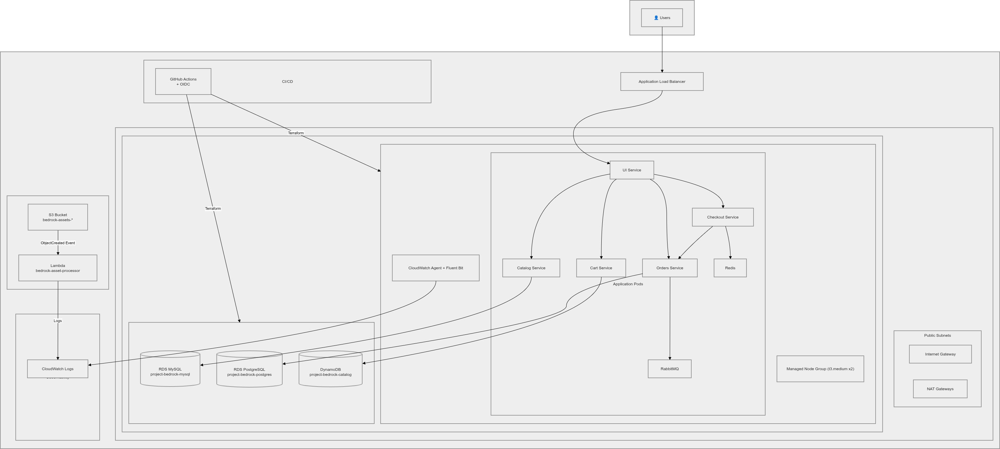

# Project Bedrock - InnovateMart EKS Deployment

# Project Bedrock - InnovateMart EKS Deployment


---

## 📋 Table of Contents

1. [Overview](#overview)
2. [Architecture](#architecture)
3. [Infrastructure Components](#infrastructure-components)
4. [Prerequisites](#prerequisites)
5. [Deployment Guide](#deployment-guide)
6. [CI/CD Pipeline](#cicd-pipeline)
7. [Accessing the Application](#accessing-the-application)
8. [Observability](#observability)
9. [Event-Driven Extension](#event-driven-extension)
10. [Cleanup](#cleanup)

---

## Overview

Project Bedrock provisions a secure, production-grade Amazon EKS cluster and deploys the AWS Retail Store Sample Application. The infrastructure is fully automated using Terraform, with a CI/CD pipeline via GitHub Actions, centralized logging via CloudWatch, and an event-driven serverless component for asset processing.

**Live Application:** [http://k8s-default-retailst-ac0dc99e79-2117128194.us-east-1.elb.amazonaws.com](http://k8s-default-retailst-ac0dc99e79-2117128194.us-east-1.elb.amazonaws.com)

---

## Architecture


### Data Flow
```
User Browser
    ↓
AWS ALB
    ↓
Kubernetes UI Service (Port 80)
    ↓
    ├→ Catalog Service → RDS MySQL
    ├→ Orders Service → RDS PostgreSQL
    ├→ Carts Service → DynamoDB (IRSA)
    ├→ Checkout Service → RabbitMQ
    └→ Assets Service → S3 (via Lambda processor)
```

---

## Infrastructure Components

| Component | Resource | Details |
|-----------|----------|---------|
| **VPC** | `project-bedrock-vpc` | 10.0.0.0/16, 2 AZs, public + private subnets |
| **EKS Cluster** | `project-bedrock-cluster` | v1.36, managed node group (t3.medium x2) |
| **RDS MySQL** | `project-bedrock-mysql` | db.t3.micro, private subnets, retail_mysql DB |
| **RDS PostgreSQL** | `project-bedrock-postgres` | db.t3.micro, private subnets, retail_postgres DB |
| **DynamoDB** | `project-bedrock-catalog` | PAY_PER_REQUEST, hash key: id |
| **S3** | `bedrock-assets-alt-soe-025-4126` | Versioned, SSE-S3 encrypted |
| **Lambda** | `bedrock-asset-processor` | Python 3.12, S3 ObjectCreated trigger |
| **ALB** | Auto-provisioned via Ingress | Internet-facing, target-type: ip |
| **Secrets Manager** | `project-bedrock/mysql-credentials` | RDS credentials (securely stored) |
| **IAM User** | `bedrock-dev-view` | ReadOnlyAccess + K8s view RBAC |

### Application Services (10 pods)

| Service | Image | Backend |
|---------|-------|---------|
| UI | `retail-store-sample-ui:1.6.1` | Storefront |
| Catalog | `retail-store-sample-catalog:1.6.1` | MySQL (RDS) |
| Carts | `retail-store-sample-cart:1.6.1` | DynamoDB |
| Orders | `retail-store-sample-orders:1.6.1` | PostgreSQL (RDS) |
| Checkout | `retail-store-sample-checkout:1.6.1` | Redis + RabbitMQ |
| MySQL | `mysql:8.0` | In-cluster (for catalog) |
| PostgreSQL | `postgres:16.1` | In-cluster (for orders) |
| DynamoDB Local | `aws-dynamodb-local:1.25.1` | In-cluster (for carts) |
| RabbitMQ | `rabbitmq:3-management` | Message broker |
| Redis | `redis:6.0-alpine` | Session cache |

---

## Prerequisites

- AWS CLI configured with administrative credentials
- Terraform >= 1.5
- kubectl >= 1.30
- Helm >= 3.16
- Git
- GitHub account with repository secrets configured

---

## Deployment Guide

### 1. Clone the Repository

```bash
git clone git@github.com:emmanuelkaringi/project-bedrock-karatu-2025.git
cd project-bedrock-karatu-2025
```

### 2. Bootstrap Terraform State
```bash
cd terraform/bootstrap
terraform init
terraform apply -auto-approve
cd ..
```

### 3. Configure Database Password
```bash
# Create terraform.tfvars (gitignored)
echo 'db_master_password = "YourSecurePassword123!"' > terraform.tfvars
```

### 4. Provision Infrastructure
```
cd terraform
terraform init
terraform plan
terraform apply -auto-approve
```

**Estimated time: 15-20 minutes (RDS and EKS provisioning)**

### 5. Configure kubectl
```bash
aws eks update-kubeconfig --region us-east-1 --name project-bedrock-cluster
kubectl get nodes
```

### 6. Deploy the Application
```bash
# Deploy the official retail store sample
kubectl apply -f https://github.com/aws-containers/retail-store-sample-app/releases/latest/download/kubernetes.yaml

# Wait for all pods
kubectl wait --for=condition=available deployments --all --timeout=300s
kubectl get pods
```

### 7. Install AWS Load Balancer Controller
```bash
# Associate OIDC provider
eksctl utils associate-iam-oidc-provider --region us-east-1 --cluster project-bedrock-cluster --approve

# Create IAM service account
ACCOUNT_ID=$(aws sts get-caller-identity --query Account --output text)
curl -o /tmp/iam-policy.json https://raw.githubusercontent.com/kubernetes-sigs/aws-load-balancer-controller/main/docs/install/iam_policy.json
aws iam create-policy --policy-name AWSLoadBalancerControllerIAMPolicy --policy-document file:///tmp/iam-policy.json

eksctl create iamserviceaccount \
  --cluster project-bedrock-cluster \
  --namespace kube-system \
  --name aws-load-balancer-controller \
  --attach-policy-arn arn:aws:iam::${ACCOUNT_ID}:policy/AWSLoadBalancerControllerIAMPolicy \
  --override-existing-serviceaccounts \
  --region us-east-1 \
  --approve

# Install controller
helm repo add eks https://aws.github.io/eks-charts
helm repo update
helm install aws-load-balancer-controller eks/aws-load-balancer-controller \
  --namespace kube-system \
  --set clusterName=project-bedrock-cluster \
  --set region=us-east-1 \
  --set vpcId=vpc-02ce66a77bc320342 \
  --set serviceAccount.create=false \
  --set serviceAccount.name=aws-load-balancer-controller
```

### 8. Create Ingress
```bash
kubectl apply -f - <<EOF
apiVersion: networking.k8s.io/v1
kind: Ingress
metadata:
  name: retail-store-ingress
  namespace: default
  annotations:
    kubernetes.io/ingress.class: alb
    alb.ingress.kubernetes.io/scheme: internet-facing
    alb.ingress.kubernetes.io/target-type: ip
    alb.ingress.kubernetes.io/healthcheck-path: /actuator/health
spec:
  rules:
    - http:
        paths:
          - path: /
            pathType: Prefix
            backend:
              service:
                name: ui
                port:
                  number: 80
EOF

# Get the ALB URL
kubectl get ingress -n default
```

### 9. Access the Application
Open the ALB URL in your browser. The application will be available at the address shown in `kubectl get ingress`

## CI/CD Pipeline
### GitHub Actions Workflow
The pipeline is defined in `.github/workflows/terraform.yml` and uses OIDC authentication.

### Triggers:

**Pull Request → main**: Runs terraform plan and posts result as PR comment

**Push to main**: Runs terraform apply -auto-approve

### Required GitHub Secrets
Secret Name | Description|
----------- |------------|
AWS_ROLE_ARN | ARN of the GitHub Actions IAM role
TF_VAR_db_master_password | Database master password for RDS

### How to Trigger
> Create a branch: `git checkout -b feature/change`

> Make infrastructure changes in the `terraform/ directory`

> Commit and push: `git push origin feature/change`

> Create a Pull Request to main

> Review the terraform plan output in the PR comment

> Merge to main to apply changes

## Accessing the Application
### Public URL
**Live Application**: Use the ALB address provided.

### Local Access (Port Forward)
``` bash
kubectl port-forward -n default svc/ui 8080:80
# Open http://localhost:8080
```

## Observability
### CloudWatch Log Groups

Log Group | Content
--------- | -------
`/aws/eks/project-bedrock-cluster/cluster` | Control plane logs (API, Audit, Authenticator, ControllerManager, Scheduler)
`/aws/containerinsights/project-bedrock-cluster/application` | Application container logs
`/aws/containerinsights/project-bedrock-cluster/dataplane` | Network and data plane metrics
`/aws/containerinsights/project-bedrock-cluster/host` | Node-level metrics
`/aws/lambda/bedrock-asset-processor` | Lambda execution logs

### Accessing Logs
```bash
# View application logs
aws logs describe-log-streams \
  --log-group-name /aws/containerinsights/project-bedrock-cluster/application \
  --region us-east-1

# View Lambda logs
aws logs get-log-events \
  --log-group-name /aws/lambda/bedrock-asset-processor \
  --log-stream-name $(aws logs describe-log-streams --log-group-name /aws/lambda/bedrock-asset-processor --region us-east-1 --query 'logStreams[0].logStreamName' --output text) \
  --region us-east-1
```

## Event-Driven Extension
### S3 to Lambda Flow
> Upload a file to `s3://bedrock-assets-alt-soe-025-4126/`

> S3 Event Notification triggers Lambda bedrock-asset-processor

> Lambda logs the filename to CloudWatch


### Testing
```bash
# Using developer credentials
aws s3 cp test-image.jpg s3://bedrock-assets-alt-soe-025-4126/ --profile <your-IAM-user>

# Check Lambda logs
aws logs get-log-events \
  --log-group-name /aws/lambda/bedrock-asset-processor \
  --log-stream-name <stream-name> \
  --region us-east-1
```

## Cleanup
### To destroy all resources:

```bash
# Delete Kubernetes resources
kubectl delete -f https://github.com/aws-containers/retail-store-sample-app/releases/latest/download/kubernetes.yaml

# Delete ALB Ingress
kubectl delete ingress retail-store-ingress -n default

# Destroy Terraform infrastructure
cd terraform
terraform destroy -auto-approve

# Destroy bootstrap (state bucket)
cd bootstrap
aws s3 rm s3://project-bedrock-tfstate-alt-soe-025-4126 --recursive
terraform destroy -auto-approve
```